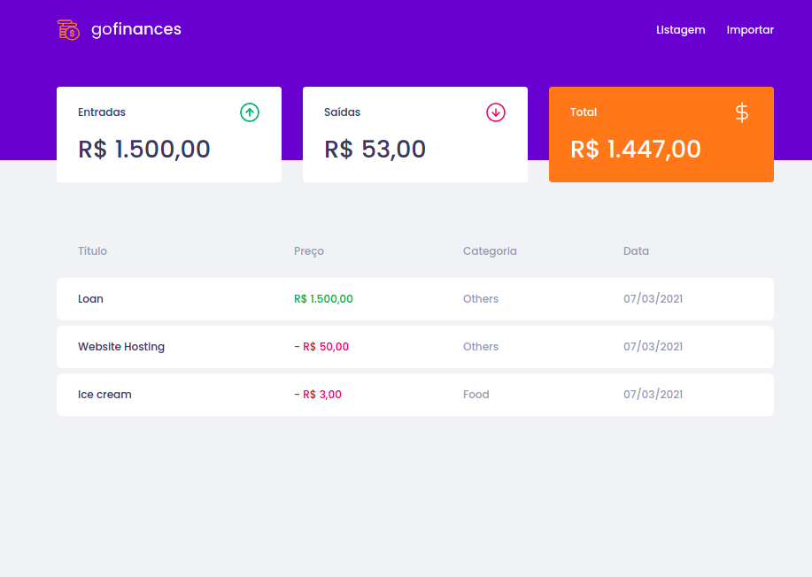
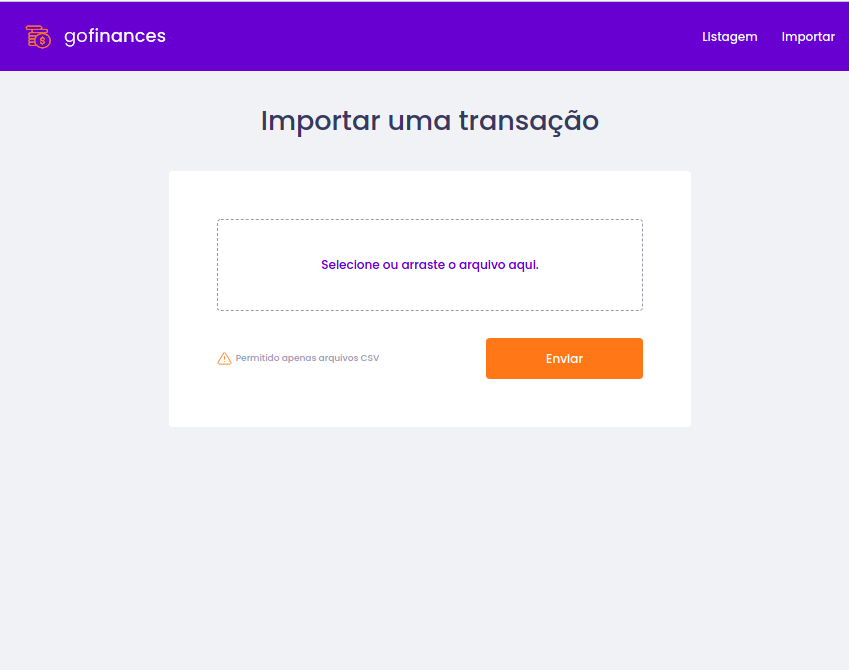

<h1 align="center">
     💵 <a href="#" alt="site do ecoleta"> Go-finance </a>
</h1>

<h3 align="center">
    💸 Gerêncie suas finanças de maneira prática, importando os dados do excel ou outros aquivos em csv.
</h3>

<p align="center">
  

  
  
  <a href="https://github.com/tgmarinho/README-ecoleta/commits/master">
    
  </a>
    
   
   
  <a href="https://app.rocketseat.com.br/me/vinicius-silva">
    
    </a>
  
 
</p>

<h4 align="center">
	🚧   Concluído 🚀 🚧
</h4>


## 💻 Sobre o projeto

♻️ Go-finance - É um app para getão de finanças, que tem como objetivo poder usar arquivos csv, como os do excel, para inserção de novos dados para o balanço financeiro. 

Projeto desenvolvido durante a **Bootcamp-GoStack** oferecida pela [Rocketseat](https://blog.rocketseat.com.br).

---

## ⚙️ Funcionalidades

- [x] Você pode importar suas entradas e saídas para controle:
  - [x] Historico e total das entradas
  - [x] Historico e total das saídas
  - [x] A app te impede simular um saque maior que o seu saldo, simulando uma situação real.
  - [x] Importação prática de arquivos em .csv. 
  
---

## 🎨 Layout


<p >
  
  
</p>

---

## 🚀 Como executar o projeto

Este projeto é divido em dois repositórios:
1. Backend (<a href="https://github.com/viniciusfal/cash-machine">cash-machine</a>) 
2. Frontend (go-finances)

💡Tanto o Frontend quanto o Mobile precisam que o Backend esteja sendo executado para funcionar.

### Pré-requisitos

Antes de começar, você vai precisar ter instalado em sua máquina as seguintes ferramentas:
[Git](https://git-scm.com), [Node.js](https://nodejs.org/en/). 
Além disto é bom ter um editor para trabalhar com o código como [VSCode](https://code.visualstudio.com/)

#### 🎲 Rodando o Backend (servidor)

```bash

# Clone este repositório
$ git@github.com:viniciusfal/cash-machine.git

# Acesse a pasta do projeto no terminal/cmd
$ cd cash-machine

# Instale as dependências
$ yarn install

# Execute a aplicação em modo de desenvolvimento
$ yarn dev:server

# O servidor inciará na porta:3333 - acesse http://localhost:3333 

```


#### 🧭 Rodando a aplicação web (Frontend)

```bash

# Clone este repositório
$ git@github.com:viniciusfal/go-finance.git

# Acesse a pasta do projeto no seu terminal/cmd
$ cd go-finance

# Instale as dependências
$ yarn

# Execute a aplicação em modo de desenvolvimento
$ yarn start

# A aplicação será aberta na porta:3000 - acesse http://localhost:3000

```

---

## 🛠 Tecnologias

As seguintes ferramentas foram usadas na construção do projeto:

#### **Website**  ([React](https://reactjs.org/)  +  [TypeScript](https://www.typescriptlang.org/))

-   **[React Router Dom](https://github.com/ReactTraining/react-router/tree/master/packages/react-router-dom)**
-   **[Styled-components](https://styled-components.com/docs/basics)**
-   **[Axios](https://github.com/axios/axios)**
-   **[Filesize](https://www.npmjs.com/package/filesize)**
-   **[React Dropzone](https://github.com/react-dropzone/react-dropzone)**

> Veja o arquivo  [package.json](https://github.com/viniciusfal/go-finance/blob/master/package.json)


#### [](https://github.com/tgmarinho/Ecoleta#utilit%C3%A1rios)**Utilitários**

-   Editor:  **[Visual Studio Code](https://code.visualstudio.com/)** 
-   Teste de API:  **[Insomnia](https://insomnia.rest/)**
-   Fonte: **[Poppins](https://fonts.google.com/specimen/Poppins)**


---


## 🦸 Autor

<a href="https://app.rocketseat.com.br/me/vinicius-silva">
 
 <br />
 <sub><b>Vinicius Silva</b></sub></a> <a href="https://app.rocketseat.com.br/me/vinicius-silva">🚀</a>
 <br />

[](https://www.linkedin.com/in/vinicius-dev-silva/) 
[](mailto:viniciusoficialc20@gmail.com)

---

## 📝 Licença

Este projeto esta sobe a licença [MIT](./LICENSE).

Feito com ❤️ por Thiago Marinho 👋🏽 [Entre em contato!](https://www.linkedin.com/in/vinicius-dev-silva/)

